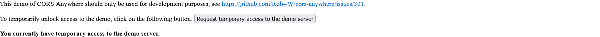

# Exercice 2 : Appels asynchrones vers un serveur distant

## Modalités

**Ne pas modifier le HTML ou CSS directement**.

**Dans le HTML, vous êtes autorisé à modifier uniquement l'attribut source `src` de la balise `<script>`**.

**Toutes les modifications doivent se faire à travers JavaScript**.

**Utilisez le plus possible les classes (programmation orienté objet)**.

---

## Scénario 1

En tant qu'utilisateur ;

Lorsque, je suis sur la page de news ;

Alors, je devrais voir des articles composés de : 
- Un titre ;
- Une image de couverture ;
- Un lien hypertexte vers l'article depuis sa source ;
- L'auteur ; 
- La date de publication ;

## Spécifications techniques du scénario 1

- La page de news se nomme `news.html`.
- Le template HTML d'un article (modèle) est dans le dossier `templates/html/_partials/article.html`, vous devez l'utiliser pour afficher les articles récupérés depuis `France 24` selon ce modèle.
- Le lien du flux RSS contenant l'actualité de `France 24` est : [https://cors-anywhere.herokuapp.com/https://api.factmaven.com/xml-to-json?xml=https://www.france24.com/fr/rss](https://cors-anywhere.herokuapp.com/https://api.factmaven.com/xml-to-json?xml=https://www.france24.com/fr/rss).

Vous devez absolument autoriser les appels externes avec le proxy `cors-anywhere`, depuis le réseau (devTools), cliquez sur la requête concernée puis cliquez sur le bouton `Request temporary access to the demo server`

Petite explication sur le lien : 

- La première partie du lien nous permet d'effectuer une requête sans blocage du navigateur dans notre environnement de développement cf [HTTP CORS](https://developer.mozilla.org/fr/docs/Glossary/CORS) ;

- La deuxième partie permet de transformer le résultat reçu du XML en JSON (plus facile à manipuler) des informations que l'on souhaite traiter.

---

## Scénario 2

En tant qu'utilisateur ;

Lorsque, je clique sur l'élément html permettant de visualiser le contenu textuel de l'article ;

Alors, je devrais voir le contenu textuel (description) et le titre de l'article affichés au premier plan.

### Spécifications techniques du scénario 2

- Affichez une modale pour la description et le titre de l'article
- Proposez un bouton de fermeture qui permet de fermer la modale du premier plan de notre page.
- Le `CSS` spécifique à la gestion des modales est fourni `3-exercices/0-front/templates/css/modal.css`.

---

## Scénario 3

En tant qu'utilisateur ;

Lorsque, le formulaire courant correspond au formulaire d'inscription ;

Et que je clique sur le bouton "Connexion" ;

Alors le formulaire de connexion contenant les champs suivants devrait être affiché :
- E-mail ;
- Mot de passe ;

### Spécifications techniques du scénario 3

- Utilisez le template du formulaire de connexion présent dans le fichier `3-exercices/0-front/templates/html/_partials/sign-in.html`.

---

## Scénario 4

En tant qu'utilisateur ;

Lorsque, le formulaire courant correspond au formulaire de connexion ;

Et que je clique sur le bouton "Inscription" ;

Alors, le formulaire d'inscription contenant les champs suivants devrait être affiché à la place :
- Nom ;
- Prénom ;
- Email ;
- Mot de passe ;
- Confirmation de mot de passe ;
- Age ;
- Pays ;
- Ville ;

### Spécifications techniques du scénario 4

- Utilisez le template du formulaire d'inscription présent dans le fichier `3-exercices/0-front/templates/html/_partials/sign-up.html`

