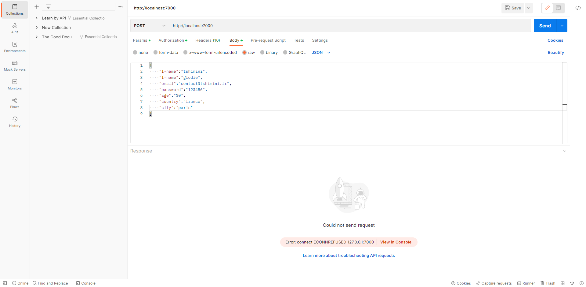

# Exercice 5 : gestion de l'inscription

1. Gérez l'inscription d'un nouvel utilisateur depuis notre application frontend.
2. Stockez les données dans le fichier `users.json` sur le serveur dans un sous-dossier nommé `data`.

## Spécification technique

1. Les données depuis le front doivent être envoyé au format json.
Effectuez vos tests via `postman` ou `hoppscotch` avant de faire le lien entre le front et le back-end.

2. Caractéristiques du serveur back-end :
- Écoute sur le port `7000` ;
- Méthode `POST` ;
- URL `/signup` ;
3. Le dossier `data` et le fichier `users.json` doivent être créer depuis votre programme. Pour cela :
- Créez une fonction qui vérifie qu'un fichier ou un dossier exist ;
- Créez une fonction qui crée un fichier avec du contenu ;
- Créez une fonction qui lit les données d'un fichier ;
- Si l'utilisateur existe déja dans le fichier `users.json`, le serveur doit répondre au format JSON  `{"message": "user already exists"}` avec un status `200`.
- Si tout s'est bien déroulé, le serveur répond au format JSON `{"message": "user created"}` avec un status égale à `201`.
- Dans tous les autres cas retourner une erreur `500`.